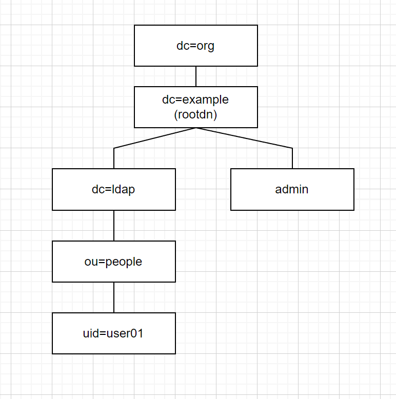

# OpenLDAPを試した（bitnami/openldapで）

## 注意

- bitnami/openldapのイメージを用いて、オリジナルのldifファイルで初期設定したい場合の**個人的な**備忘録。

## 概要

- LDAPサーバを構築して、phpLDAPadminで内容を確認する。
- 構築にはdockerhubのイメージを利用する。
    - [openldap: bitnami/openldap](https://hub.docker.com/r/bitnami/openldap)
    - [phpldapadmin: Mirantis/docker-phpldapadmin](https://github.com/Mirantis/docker-phpldapadmin)

### 初期構成

- LDAPツリー構成

    

## 構築

1. `ldifs/` 内のldifファイルを修正する（非必須）
2. `docker-compose.yml`の内容を修正する（非必須）
3. `docker compose up -d`でコンテナ起動
4. http://localhost:6001 にアクセス
5. phpldapadminで画面左の`login`からログイン画面を開く
    - ログイン情報
        - Login DN: `cn=admin,dc=example,dc=org`
        - Password: `adminpassword`
6. 画面左にツリーが表示される。（`+`で展開して、内容を確認する）

## ハマったところ

1. ルートDNに指定したディレクトリが作成されない
    - `docker-compose.yml`での環境変数設定で、`LDAP_ROOT`で指定したオブジェクトが作成されていなかった。
    - 今回のように、自分で作成した`.ldif`ファイルで構築する場合、`LDAP_ROOT`で指定したオブジェクトをまず作成する必要がある。
    - [公式ドキュメント: "Configuration"](https://hub.docker.com/r/bitnami/openldap)にある以下の記述の通り？
        
        > You should set LDAP_ROOT to your base to make sure the olcSuffix configured on the database matches the contents imported from the LDIF files.

## その他メモ

1. LDAPサーバのポート番号指定
    - 環境変数`LDAP_PORT_NUMBER=389`で指定可能。デフォルトは`1389`。
    - デフォルト（1389）を使用する場合、phpldapadmin側でそのポートを指定する必要がある（phpldapadminはデフォルト`389`で接続に行く）
    - 本リポジトリでの初期構成では、LDAPサーバをデフォルト（`1389`）とし、phpldapadmin側の環境変数にて接続先LDAPサーバのポートを1389に指定している。
        ```
        PHPLDAPADMIN_LDAP_HOSTS: "#PYTHON2BASH:[{'ldap': [{'server': [{'tls': False},{'port': 1389}]},{'login': [{'bind_id': 'cn=admin,dc=example,dc=org'}]}]}]"
        ```
    - LDAPサーバ側のポート番号を`389`に指定する場合、`PHPLDAPADMIN_LDAP_HOSTS: "ldap"`で済む。（dockerサービス名で指定）

1. phpldapadminは、デフォルトがHTTPSなので、`docker-compose.yml`にて環境変数`PHPLDAPADMIN_HTTPS: "false"`を設定し、HTTPにしている。
